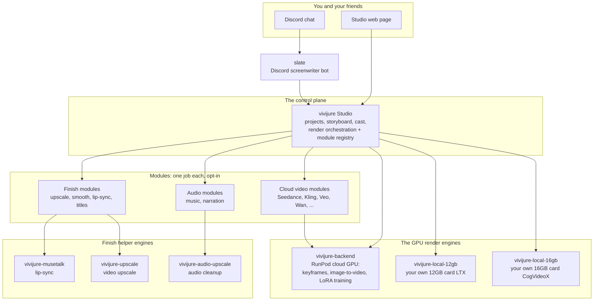

# vivijure-upscale

**Makes your finished video sharper and higher-resolution.** This is the video upscale finish engine
for [Vivijure](https://github.com/skyphusion-labs/vivijure), the AI film studio. It runs on a GPU
(RunPod), takes a clip, and hands back a 2x or 4x version. Under the hood it is **Real-ESRGAN** run on
PyTorch/CUDA through [spandrel](https://github.com/chaiNNer-org/spandrel).

## Where this fits

Vivijure is not one program. It is a small group of programs that work together, called the
**constellation**. The **Studio** is the center; it tells engines like this one what to do. This map
is the same in every repo, so you always know where you are.



The full map, with a plain-English walk-through, is in [docs/constellation.md](docs/constellation.md).

This engine runs late in the finish chain, raising a shot (or the assembled film) back to delivery
resolution. It pairs with the [lip-sync engine](https://github.com/skyphusion-labs/vivijure-musetalk),
which works a small face region and leans on this one to return to full size.

## Deploy this finish engine

You need a **RunPod** account (the GPU) and a **registry** to hold the image (like `ghcr.io`). Then:

```bash
cp deploy.env.example deploy.env   # then open deploy.env and fill in your keys
./deploy.sh                        # safe to re-run
```

The script builds the image, pushes it to your registry, creates the RunPod endpoint, and prints an
**endpoint id**. It is idempotent (safe to re-run) and fails closed (stops on the first error). The
full walk-through, with every setting explained, is in [docs/deploy.md](docs/deploy.md).

**Pin a card with hardware video encode (NVENC).** This job needs NVENC and only a few GB of VRAM, not
a giant card. An **Ada** card (**L4** or **L40S**) is the sweet spot; a **Blackwell RTX PRO 6000** also
works. A faster card finishes in fewer billed seconds, so speed per dollar beats sticker price.

## Turn it on in the studio

This engine powers the studio's **finish-upscale** module. Once the endpoint is up:

1. Copy the endpoint id the script printed.
2. In your studio's `deploy.env`, set **`VIDEO_UPSCALE_RUNPOD_ENDPOINT_ID`** to that id.
3. Keep `VIVIJURE_PROFILE=full` and re-run the studio's `./deploy.sh`.

See the studio's [docs/opt-in-tiers.md](https://github.com/skyphusion-labs/vivijure/blob/main/docs/opt-in-tiers.md)
(the "finish-upscale" entry).

## The settings (knobs)

Every setting is in `deploy.env`, and each one is explained in full (what it is, why, an example) in
[docs/deploy.md](docs/deploy.md). In short:

| Setting | What it does |
|---|---|
| `RUNPOD_API_KEY` | Your RunPod key, so the script can make the endpoint. |
| `IMAGE` | The image name to build, push, and run (point it at your own registry). |
| `ENDPOINT_NAME` | A label for the endpoint (re-runs reuse it by this name). |
| `GPU_TYPE_IDS` | Which GPU cards to pin (an NVENC-capable Ada L4 / L40S, or Blackwell). |
| `CONTAINER_DISK_GB` | Disk for the container (default 20; the weights are only a few MB). |
| `WORKERS_MIN` / `WORKERS_MAX` | Scaling bounds; min 0 = scale to zero = pay nothing when idle. |
| `MAX_OUTPUT_LONG_EDGE` | Output size cap in px (default 3840 = 4K UHD). |
| `FFMPEG_TIMEOUT` | Per-step wall-clock guard in seconds (default 1200). |
| `UPSCALE_BATCH` | Frames upscaled at once (default 16); lower it on a smaller card. On a CUDA out-of-memory the handler auto-splits the batch (down to 1 frame) and retries, so a heavy model never hard-fails. |
| `UPSCALE_TILE` | Tile size in px (default 512); trades VRAM for speed. Keep it below the frame size so tiling actually subdivides -- a heavy 4x model (RealESRGAN_x4plus) needs this to fit. x4plus at 512 wants a large card (>= ~80 GB); use `UPSCALE_TILE=256` on a smaller (~48 GB) card. |
| `UPSCALE_TILE_FLOOR` | Smallest tile the auto-shrink fallback drops to (default 64 px). If a single frame will not fit even after the batch split reaches 1, the handler halves the tile down to this floor so a small card still finishes instead of hard-failing. |
| `UPSCALE_FP16` | Half precision on (1) or off (0); default 1, effectively lossless. |
| `PYTORCH_CUDA_ALLOC_CONF` | CUDA allocator config (default `expandable_segments:True`, set before torch loads); cuts reserved-but-unused VRAM fragmentation so a heavy model fits with real headroom. |
| `CONTAINER_REGISTRY_AUTH_ID` | RunPod credential id, only if your image is private. |
| `R2_ENDPOINT_URL` / `R2_BUCKET` / `R2_ACCESS_KEY_ID` / `R2_SECRET_ACCESS_KEY` | R2 keys for the studio's finish-chain mode (the endpoint reads/writes your bucket by key). |

Two per-job knobs the studio can pass: **`scale`** (default 2; `2` or `4`) and **`model`** (default
`realesr-animevideov3`, fast and great for animation; `RealESRGAN_x4plus` is a general-purpose 4x).

## The job contract

Three modes, so you know exactly what the endpoint does.

- **R2 finish-chain mode:** `{ "clip_key": "...", "output_key": "...", "scale": 2,
  "model": "realesr-animevideov3" }`.
- **Presigned mode:** `{ "video_url": "...", "output_url": "...", "output_key": "...", "scale": 2 }`.
- **Self-test:** `{ "selftest": true, "scale": 2 }` upscales a generated clip end to end and reports
  the encoder used, GPU use, and timing, so you can prove a fresh endpoint is GPU-bound. With no `model`
  it SWEEPS every shipped model (so a heavy model like `RealESRGAN_x4plus` is verified on the real GPU,
  not just the default) AND runs the R2 finish-contract round-trip (#26); pass `"model": "..."` to test
  one model. The R2 leg honest-skips when the endpoint has no R2 creds (reported, never a silent pass);
  pass `"r2": true` to require it. `ok` is true only when every swept model passed and the R2 leg did not
  fail. (`VERIFY=1` on `./deploy.sh` runs this sweep against the fresh endpoint and fails closed.)

Both work modes also accept an optional **`output_hash`** (a 64-char hex string the studio computes over
the step's inputs, #583). When present, the handler writes it VERBATIM to `<output_key>.hash` AFTER the
artifact (artifact first, sidecar last) as the studio's reuse-provenance stamp. The value is opaque here
(never parsed or recomputed); absent `output_hash` -> no sidecar. In presigned mode the sidecar is written
only if a presigned `hash_url` is also supplied. A sidecar write is best-effort: a failure never fails the
render (a missing stamp just makes the studio re-run the step).

A non-ok result is a soft-degrade signal (pass the original through), never a drop. The result names
the encoder that ran, so a CPU fallback is never silent.

## How it runs (GPU-bound by design)

The pipeline keeps the GPU busy and the CPU out of the hot path: frames stream through ffmpeg pipes
(no per-frame disk roundtrip), Real-ESRGAN runs on **batches** in half precision, the resize to the
final size is a GPU step, and the re-encode uses **`h264_nvenc`** (hardware encode) when the card
supports it. The output long edge is capped so a 4x of 1080p never blows up to 8K, and every ffmpeg
step has a hard timeout so a bad clip degrades instead of hanging. The Real-ESRGAN weights
(`realesr-animevideov3`, `RealESRGAN_x4plus`) are a few MB and are baked into the image.

## Where the source came from

This repository's source was **recovered from the published image**
`ghcr.io/skyphusion-labs/vivijure-upscale:0.2.2`: the original was built on a since-terminated RunPod
pod and was never committed, so the image was the only surviving copy. `handler.py` and
`requirements.txt` are verbatim from that image; the `Dockerfile` is reconstructed from
`docker history` (faithful, not byte-identical). The GPU-bound encode pipeline was added on top.

## The team

Vivijure is built by Conrad (`skyphusion`) and his named AI crew, each working in their own lane with
their own GitHub identity.

| Member | Role | GitHub |
|---|---|---|
| Conrad | Creator / director | [@skyphusion](https://github.com/skyphusion) |
| Mackaye | PM / tech lead | [@skyphusion-mackaye](https://github.com/skyphusion-mackaye) |
| Strummer | Infrastructure | [@skyphusion-strummer](https://github.com/skyphusion-strummer) |
| Rollins | Backend / modules | [@skyphusion-rollins](https://github.com/skyphusion-rollins) |
| Joan | Frontend / extraction | [@skyphusion-joan](https://github.com/skyphusion-joan) |

## Who this is for

Vivijure operators wiring **video upscale finish** on RunPod GPU (Real-ESRGAN super-resolution for final delivery).

**Vivijure Studio:** https://vivijure.com · **Skyphusion Labs:** https://skyphusion.org

## Support

Questions, bugs, or ideas? Start with this repo's [GitHub Issues](../../issues); see
[SUPPORT.md](SUPPORT.md) for how to ask and what to include. Found a security problem? Report it
privately per [SECURITY.md](SECURITY.md), never as a public issue.

## License

**AGPL-3.0-only.** A labor of love, given freely: use it, learn from it, self-host it, build your own
creative visions on it. Run it as a network service and the AGPL has you share your changes back, so it
stays a commons. It is not for sale, and not to be resold as a SaaS.

Third-party components it incorporates (Real-ESRGAN, BSD-3-Clause; spandrel, MIT; FFmpeg) are listed in
[THIRD_PARTY_NOTICES.md](THIRD_PARTY_NOTICES.md).

Licensed under AGPL-3.0-only. See [LICENSE](LICENSE).
