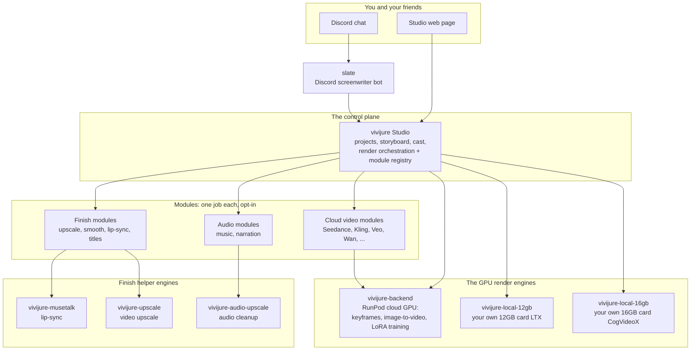

# Where each piece fits: the Vivijure map

> **You are here:** `vivijure-upscale` is the **video upscale** finish engine -- one box on this map.

Vivijure is not one program. It is a small group of programs that work together. We call the
whole group the **constellation**. This page shows the map once. Every repo in the constellation
shows this same map, so you always know where you are.

The **Studio** is the center. It is the control plane: it holds your projects, your storyboards,
your cast, and it tells everything else what to do. You talk to the Studio; the Studio talks to
everything else.

## How to read the map

- **You** start at the top. You either chat with the **slate** bot in Discord, or you open the
  **Studio web page**. Both lead to the same place: the Studio.
- **The Studio** (this control plane) owns your work and decides what runs. It does not render
  video itself. It hands the heavy work to a **module**.
- **A module** is a small, opt-in worker that does one job: make a video clip, upscale it, add a
  music bed, sync lips to speech. You turn on only the modules you want. The Studio keeps a
  **registry** of the modules you have, and the web page builds itself from that registry, so a
  new module shows up in the UI on its own.
- **The GPU engines** do the real rendering. You pick where that happens: **vivijure-backend** on
  rented cloud GPUs (RunPod), or your **own graphics card** at home with the local doors
  (`vivijure-local-12gb` / `vivijure-local-16gb`).
- **The finish engines** clean up the result: sharper video, smoother motion, lips that match the
  voice, cleaner audio.

## The three doors to a GPU

The Studio can reach a GPU three honest ways. You choose; nothing is hidden.

| Door | What it means | Best for |
|---|---|---|
| **Cloud** | Rent a GPU by the second on RunPod. | No good card at home; big jobs. |
| **Own GPU (local)** | Use the graphics card in your own computer. | You have a 12GB+ card and want zero cloud cost. |
| **Bring your own (byo)** | Point the Studio at a GPU box you already run. | You already have a GPU server. |

## Two ways a module plugs in

A module connects to the Studio through one shared, typed contract (`vivijure-module/2`). There
are two transports, and a module does not know or care which one carries it:

1. **Service binding** (built in): the module ships inside a normal deploy. Simple, free, always
   available. This is the default for self-hosting.
2. **Dynamic dispatch** (Workers for Platforms): the module is uploaded on its own and installed
   without redeploying the Studio. This is an opt-in, paid Cloudflare add-on we use on the hosted
   studio. Self-hosting never needs it.

Either way, the Studio calls the module the same way, and the module answers the same way. That
shared contract is what lets the community write new modules without touching the core.

---

*This map is the same in every constellation repo. If you are reading it inside a specific repo's
README, that repo is one box on this map.*
